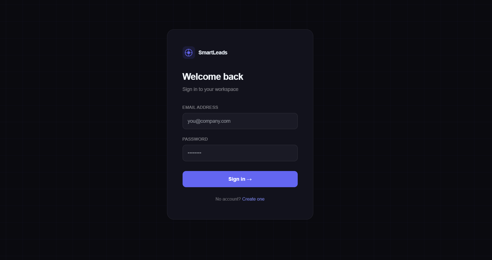
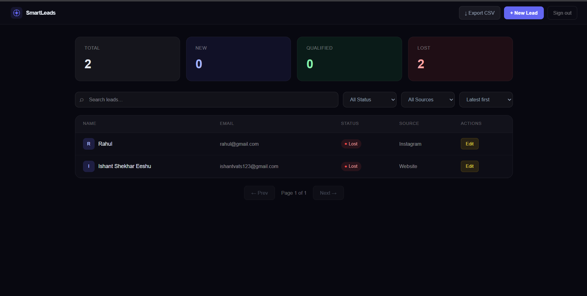
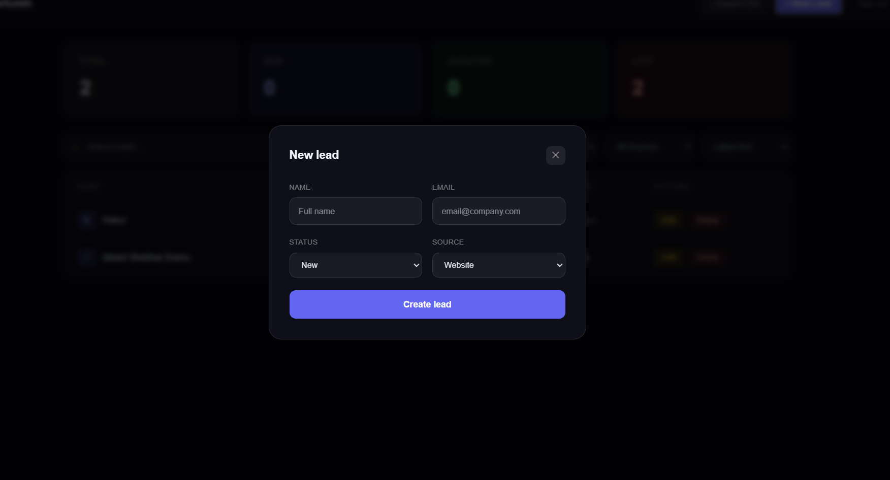
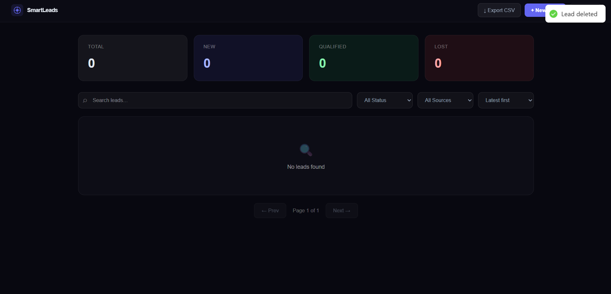

# 📊 Smart Leads Dashboard — MERN Stack

> A scalable, production-inspired Lead Management Dashboard built with the MERN stack, TypeScript, and clean architecture.


---

## 🌐 Live Deployment

### Frontend (Vercel)
https://smart-leads-vert.vercel.app/

### Backend API (Render)
https://smart-leads-api-ttq2.onrender.com/

---

## 📌 Project Overview

> Built as a complete lead management solution evaluating frontend development, backend API design, database modeling, state management, and real-world engineering practices.

| Feature | Description | Status |
|---------|-------------|--------|
| Authentication | JWT login/register with bcrypt + protected routes | ✅ Complete |
| Leads CRUD | Create, read, update, delete leads | ✅ Complete |
| Advanced Filtering | Filter by status, source, search, and sort | ✅ Complete |
| Pagination | Backend pagination with metadata (10/page) | ✅ Complete |
| Role-Based Access Control | Admin and Sales User roles | ✅ Complete |
| CSV Export | Export filtered leads to CSV | ✅ Complete |
| Debounced Search | Optimized search with debounce | ✅ Complete |
| Docker Setup | Docker + docker-compose configuration | ✅ Complete |
| Responsive UI | Mobile-friendly, loading/empty/error states | ✅ Complete |

---

## Table of Contents

1. [Overview](#1-overview)
2. [Features](#2-features)
3. [Architecture](#3-architecture)
4. [Tech Stack](#4-tech-stack)
5. [Folder Structure](#5-folder-structure)
6. [How to Run](#6-how-to-run)
7. [Environment Variables](#7-environment-variables)
8. [API Endpoints](#8-api-endpoints)
9. [Screenshots](#9-screenshots)
10. [Role-Based Access Control](#10-role-based-access-control)

---

## 1. Overview

A full-stack **Lead Management Dashboard** built as a ServiceHive internship assignment. The platform enables sales teams to track, filter, manage, and export leads — with secure JWT authentication, role-based permissions, and a clean, responsive UI.

Each layer of the stack is strictly typed with **TypeScript** on both the frontend and backend, with proper interfaces, minimal `any` usage, and clean separation of concerns.

---

## 2. Features

### 🔐 Authentication System
- User Registration and Login
- JWT token generation and validation
- bcrypt password hashing
- Auth middleware for protected routes
- Form validation and error handling

### 📋 Leads Management (CRUD)
- Create, update, and delete leads
- View full leads list and single lead details
- Lead fields: Name, Email, Status, Source, Created At

### 🔍 Advanced Filtering & Search
- Filter by **Status**: `New` | `Contacted` | `Qualified` | `Lost`
- Filter by **Source**: `Website` | `Instagram` | `Referral`
- Search by **Name or Email** (debounced)
- Sort by **Latest** or **Oldest**
- All filters work together simultaneously

### 📄 Pagination
- Backend pagination (10 records per page)
- `skip` and `limit` implementation
- Pagination metadata in every API response

### 📤 CSV Export
- Export the currently filtered lead list to CSV
- Respects active filters and search terms

---

## 3. Architecture

### Authentication Flow

```
Register → Hash Password (bcrypt) → Store User
Login    → Validate Credentials   → Generate JWT
         → JWT in Authorization header
         → Auth Middleware validates token
         → Attach user + role to request
         → Access protected endpoints
```

### Layered Architecture

```
Client Request
     ↓
React Frontend (TypeScript + TailwindCSS)
     ↓
Express API (TypeScript + Middleware)
     ↓
Service / Controller Layer  → Business logic
     ↓
Mongoose Models             → Schema & validation
     ↓
MongoDB                     → Persistence
```

### Role-Based Access

```
[Any User]
    ↓
[Auth Middleware]
    ↓
┌─────────────────────────────────────┐
│  Sales User  → View & filter leads  │
│  Admin       → Full CRUD + export   │
└─────────────────────────────────────┘
```

---

## 4. Tech Stack

| Technology | Purpose | Layer |
|------------|---------|-------|
| React.js | UI framework | Frontend |
| TypeScript | Type safety (mandatory) | Full Stack |
| TailwindCSS | Styling | Frontend |
| Node.js + Express.js | REST API server | Backend |
| MongoDB + Mongoose | Database + ODM | Backend |
| JWT | Authentication tokens | Backend |
| bcrypt | Password hashing | Backend |
| Docker + docker-compose | Containerization | DevOps |

---

## 5. Folder Structure

```
smart-leads-dashboard/
│
├── client/                            # React frontend
│   ├── src/
│   │   ├── components/                # Reusable UI components
│   │   │   ├── LeadCard/
│   │   │   ├── LeadForm/
│   │   │   ├── FilterBar/
│   │   │   └── Pagination/
│   │   ├── pages/                     # Route-level pages
│   │   │   ├── LoginPage/
│   │   │   ├── RegisterPage/
│   │   │   ├── DashboardPage/
│   │   │   └── LeadDetailPage/
│   │   ├── hooks/                     # Custom React hooks
│   │   ├── services/                  # API service functions
│   │   ├── types/                     # TypeScript interfaces & types
│   │   ├── context/                   # Auth context / state
│   │   └── utils/                     # Helpers (debounce, csv export, etc.)
│   ├── tailwind.config.ts
│   └── package.json
│
├── server/                            # Express backend
│   ├── src/
│   │   ├── controllers/               # Route handlers
│   │   ├── middleware/                # Auth, role, error middleware
│   │   ├── models/                    # Mongoose schemas (User, Lead)
│   │   ├── routes/                    # API route definitions
│   │   ├── services/                  # Business logic
│   │   ├── types/                     # Shared TypeScript interfaces
│   │   └── utils/                     # Token generation, validation
│   ├── .env.example
│   └── package.json
│
├── assets/                            # Screenshots
│   ├── login.png
│   ├── admin_view.png
│   ├── sales_view.png
│   ├── adding_lead.png
│   └── lead_deletion.png
│
├── docker-compose.yml
└── README.md
```

---

## 6. How to Run

### Prerequisites

- Node.js 18+
- MongoDB (local or Atlas URI)
- Docker (optional)

### Option A — Run Locally

**Step 1 — Clone Repository**

```bash
git clone https://github.com/<your-username>/smart-leads-dashboard
cd smart-leads-dashboard
```

**Step 2 — Setup Backend**

```bash
cd server
cp .env.example .env
# Fill in your MONGO_URI and JWT_SECRET in .env
npm install
npm run dev
```

**Step 3 — Setup Frontend**

```bash
cd client
npm install
npm run dev
```

**Step 4 — Open in Browser**

```
Frontend: http://localhost:5173
Backend:  http://localhost:5000
```

### Option B — Docker

```bash
docker-compose up
```

> ⚠️ Make sure to populate your `.env` inside `server/` before running Docker.

---

## 7. Environment Variables

Create a `.env` file inside `server/` using the provided `.env.example`:

```env
PORT=5000
MONGO_URI=mongodb://localhost:27017/smart-leads
JWT_SECRET=your_jwt_secret_here
```

> 🔒 Never commit your actual `.env` file. The `.env.example` template is included in the repo.

---

## 8. API Endpoints

### Auth — Base URL: `/api/auth`

| Method | Endpoint | Description | Auth Required |
|--------|----------|-------------|---------------|
| `POST` | `/api/auth/register` | Register a new user | ❌ |
| `POST` | `/api/auth/login` | Login and receive JWT | ❌ |

**Sample Request — Register**

```json
POST /api/auth/register
Content-Type: application/json

{
  "name": "Rahul Sharma",
  "email": "rahul@example.com",
  "password": "securepassword",
  "role": "sales"
}
```

**Sample Response — Login**

```json
{
  "token": "eyJhbGciOiJIUzI1NiJ9...",
  "user": {
    "id": "64f1a2b3c4d5e6f7a8b9c0d1",
    "name": "Rahul Sharma",
    "role": "sales"
  }
}
```

> Use the returned token as `Authorization: Bearer <token>` in all protected requests.

---

### Leads — Base URL: `/api/leads`

| Method | Endpoint | Description | Auth Required | Role |
|--------|----------|-------------|---------------|------|
| `GET` | `/api/leads` | Get all leads (filter/search/paginate) | ✅ | Admin, Sales |
| `GET` | `/api/leads/:id` | Get single lead by ID | ✅ | Admin, Sales |
| `POST` | `/api/leads` | Create a new lead | ✅ | Admin |
| `PUT` | `/api/leads/:id` | Update a lead | ✅ | Admin |
| `DELETE` | `/api/leads/:id` | Delete a lead | ✅ | Admin |
| `GET` | `/api/leads/export/csv` | Export leads as CSV | ✅ | Admin |

**Sample Query — Filtered List**

```
GET /api/leads?status=Qualified&source=Instagram&search=Rahul&sort=latest&page=1
```

**Sample Response — Leads List**

```json
{
  "data": [
    {
      "id": "64f1a2b3c4d5e6f7a8b9c0d1",
      "name": "Rahul Sharma",
      "email": "rahul@example.com",
      "status": "Qualified",
      "source": "Instagram",
      "createdAt": "2025-01-01T10:00:00Z"
    }
  ],
  "pagination": {
    "currentPage": 1,
    "totalPages": 4,
    "totalRecords": 38,
    "limit": 10
  }
}
```

---

## 9. Screenshots

### 🔵 Login — `/login`


### 🟢 Admin Dashboard — Full Access View


### 🟡 Sales User View — Restricted Access


### 🟢 Adding a Lead


### 🔴 Lead Deletion


> 📸 Screenshots captured from the live application. The UI is fully responsive across desktop and mobile.

---

## 10. Role-Based Access Control

| Action | Admin | Sales User |
|--------|-------|------------|
| View leads list | ✅ | ✅ |
| View single lead | ✅ | ✅ |
| Search & filter | ✅ | ✅ |
| Create lead | ✅ | ❌ |
| Update lead | ✅ | ❌ |
| Delete lead | ✅ | ❌ |
| Export CSV | ✅ | ❌ |

---

> ⭐ Built as part of the ServiceHive Full Stack Internship Assignment. Demonstrates production-grade MERN stack development with TypeScript, RBAC, and clean architecture.
